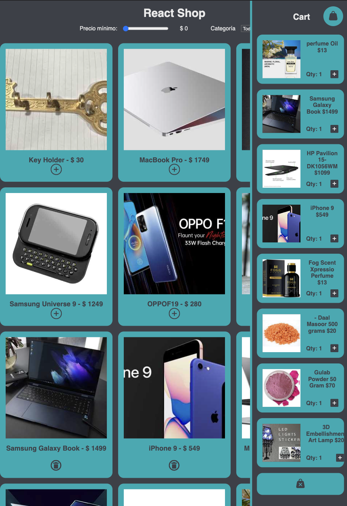

# Technical Test Junior (Reactjs)

## Description

This is a simple technical test using React with some requeriments also use [useStated](https://react.dev/reference/react/useState), [useId](https://react.dev/reference/react/useId), [useReducer](https://react.dev/reference/react/useReducer), [createContext](https://react.dev/reference/react/createContext) and [customHooks](https://react.dev/learn/reusing-logic-with-custom-hooks),:

Requirements:

-Ecommerce

- Muestra una lista de productos que vienen de un JSON
- Añade un filtro por categoría
- Añade un filtro por precio

Haz uso de useContext para evitar pasar props innecesarias.

Carrito:

  - Haz que se puedan añadir los productos a un carrito.
- Haz que se puedan eliminar los productos del carrito.
- Haz que se puedan modificar la cantidad de productos del carrito.
- Sincroniza los cambios del carrito con la lista de productos.
- Guarda en un localStorage el carrito para que se recupere al recargar la página. (da puntos)

Demo: [https://cartshop-reactjs.netlify.app](https://cartshop-reactjs.netlify.app)
